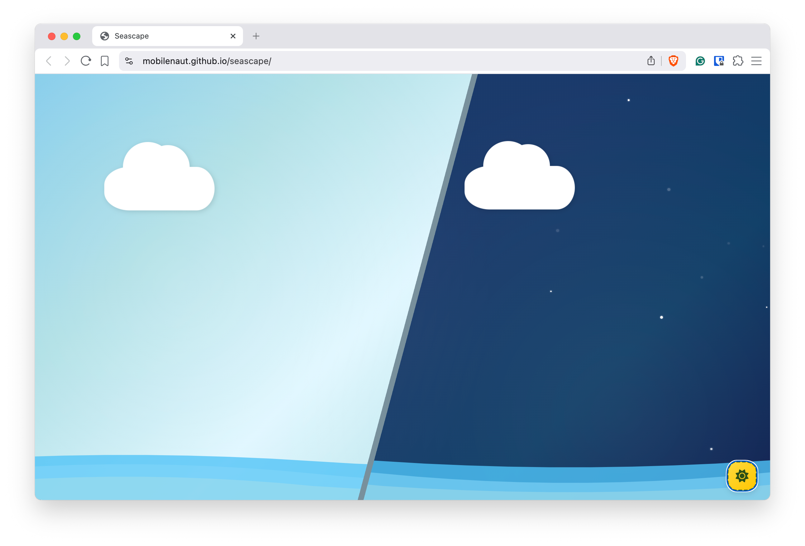

# 🌊 Seascape

An animated seascape built with CSS, showcasing drifting clouds, rolling waves, and a smooth day–night transition.



## ✨ Features

- **Animated Clouds** - Drift smoothly across the sky with realistic drop shadows
- **Rolling Waves** - Multi-layered animated waves at the bottom with varying opacity
- **Day/Night Mode** - Toggle between beautiful day and night themes with smooth transitions
- **Twinkling Stars** - Stars appear in night mode with pulsing animations
- **Responsive Design** - Fully responsive across all device sizes using CSS clamp()
- **Optimized Performance** - Uses CSS animations and JavaScript best practices for smooth 60fps rendering
- **No Dependencies** - Pure HTML, CSS, and vanilla JavaScript

## 🎮 Demo

**Live Demo:** [http://mobilenaut.github.io/seascape](http://mobilenaut.github.io/seascape)

### Day Mode
- Sky gradient with animated shimmer effect
- Three drifting clouds at different heights and speeds
- Rolling waves at the bottom
- Day/night toggle button

### Night Mode
- Dark sky gradient with night atmosphere
- Twinkling stars scattered across the sky
- Dark waves blending with night theme
- Yellow sun icon on toggle button

## 🏗️ Project Structure

```
seascape/
├── index.html          # HTML structure
├── styles.css          # All styling and animations
├── script.js           # Interactive features (day/night toggle, stars)
├── README.md           # This file
└── LICENSE             # Project license
```

## 🚀 Getting Started

### Prerequisites
- Any modern web browser (Chrome, Firefox, Safari, Edge)
- No build tools or dependencies required

### Installation

1. Clone the repository:
```bash
git clone https://github.com/mobilenaut/seascape.git
cd seascape
```

2. Open in browser:
```bash
open index.html
# or simply double-click index.html
```

3. For local server (optional):
```bash
# Using Python 3
python3 -m http.server 8000

# Using Python 2
python -m SimpleHTTPServer 8000

# Using Node.js (with http-server)
npx http-server
```

Then navigate to `http://localhost:8000`

## 🌐 Browser Support

| Browser | Support |
|---------|---------|
| Chrome | ✅ Full Support |
| Firefox | ✅ Full Support |
| Safari | ✅ Full Support |
| Edge | ✅ Full Support |
| IE 11 | ⚠️ No CSS Variables |

## 📄 License

This project is licensed under the GNU Version 3 License - see the LICENSE file for details.

## 🤝 Contributing

Feel free to fork this project and submit pull requests for any improvements!

**Enjoy the seascape! 🌊✨**